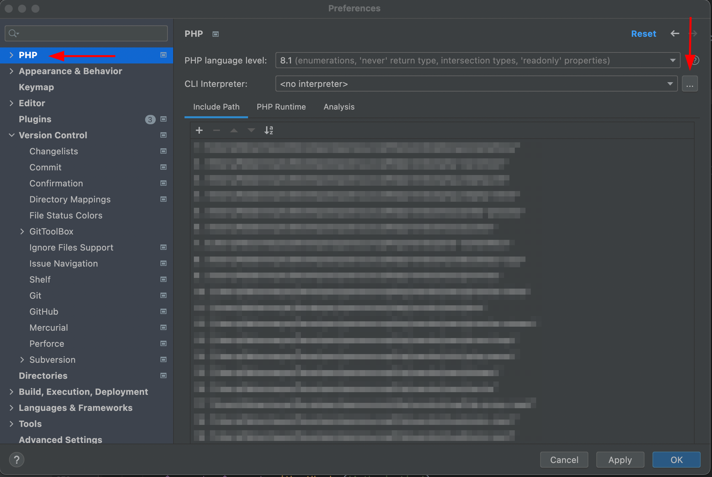
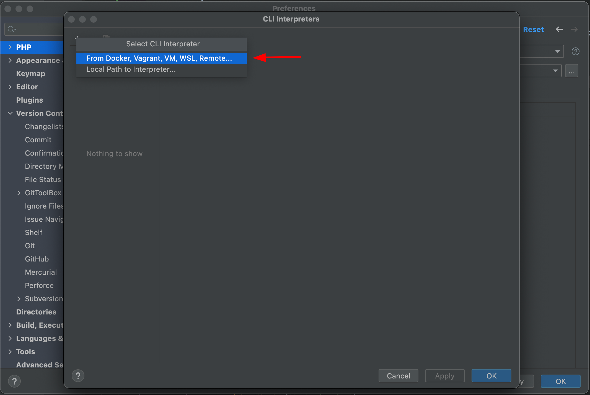
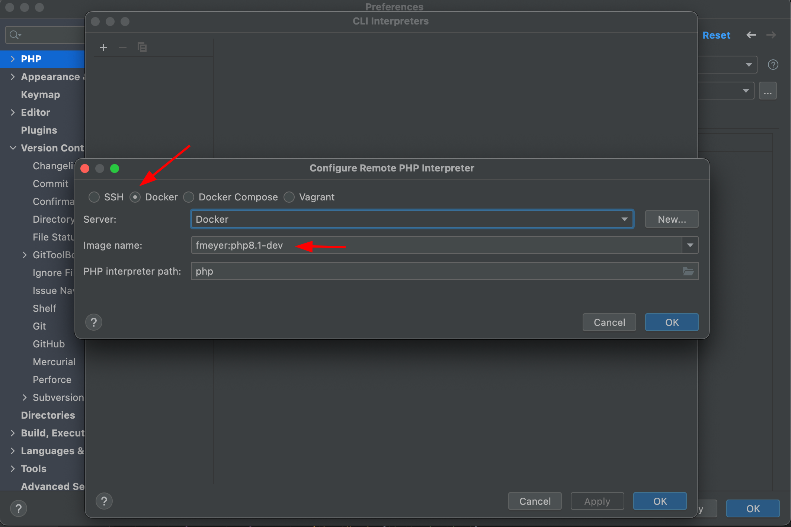
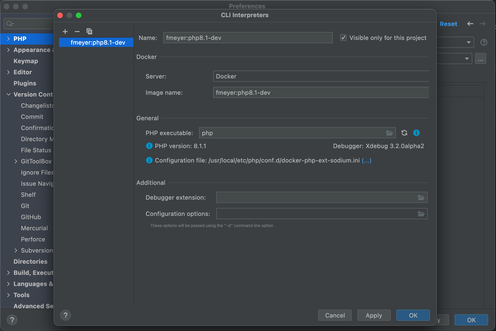
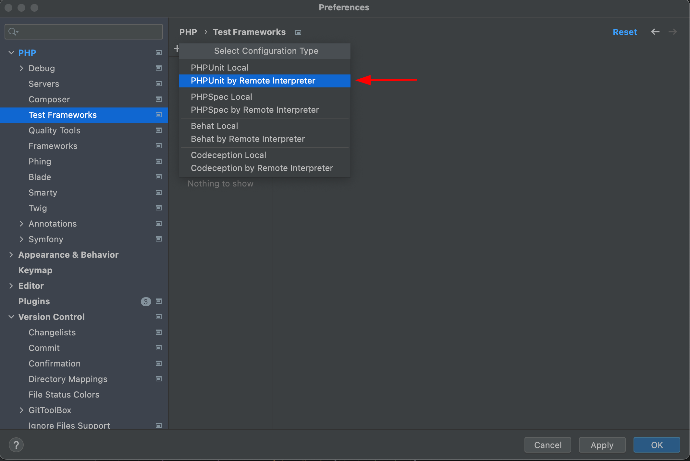
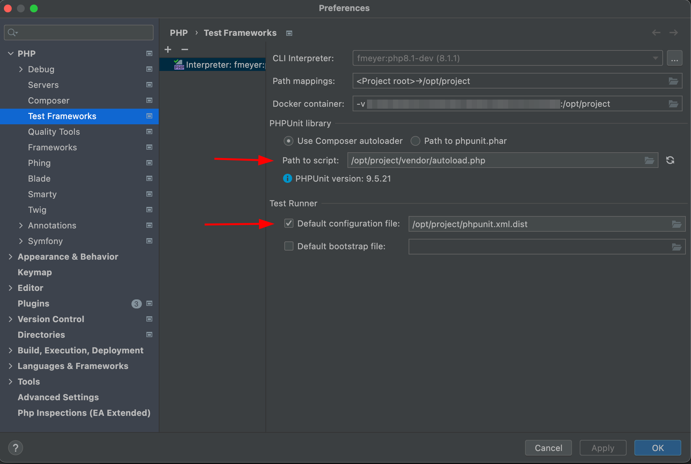

## What is Docker and why should we use it?

Docker is a containerisation technology which allows us to tailor our development environment for a specific purpose and
make it reusable on the way. A Docker image is basically a manual on how to construct a Docker container.

In the php world we can use multiple versions of php, composer and more with ease - thanks to Docker. I'm going to show
you how to containerise your development processes, how to run local php scripts with Docker (with different php
versions) and you can do this without even having a local version of php.

## Docker php in the terminal

Normally we would run local php scripts like that:

```bash{linenos=false,.command}
php script.php
```

But wouldn't it be way cooler if we could it like this?

```bash{linenos=false,.command}
php8.1 script.php
php8.0 script.php
php7.4 script.php
```

With this way we can run our php script in different versions with ease, no matter which version is locally installed.
We only need a docker command and a few aliases:

```bash{linenos=false}
alias php8.1="docker run --rm -it -v $PWD:/app -w /app php:8.1-cli php"
```

With this alias we can run our script in a docker container. But how is this working? Let's take a closer look and break
it down.

```bash{linenos=false}
docker
    run
    --rm
    -it
    -v $PWD:/app
    -w /app
    php:8.1-cli
    php
```

 - `run` = Run.
 - `--rm` Removes the container after the script is finished running.
 - `-it` Opens an interactive terminal into the container.
 - `-v` Means Volume, it mounts our current working directory to `/app` inside the container.
 - `-w` Sets the working directory inside the container to `/app` where our script will be.
 - `php:8.1-cli` The Docker image we use.
 - `php` The command to run inside the container.

Now we just have to add some aliases to our `.bashrc` or `.zshrc`, according to the php versions we need. Did you know?
We can use composer in almost the exact same way. Your `.bashrc`/`.zshrc` should look something like this:

```bash{linenos=false}
alias composer="docker run --rm -it -v $PWD:/app -v ${COMPOSER_HOME:-$HOME/.composer}:/tmp composer:latest"
alias composer1="docker run --rm -it -v $PWD:/app -v ${COMPOSER_HOME:-$HOME/.composer}:/tmp composer:1"
alias php8.1="docker run --rm -it -v $PWD:/app -w /app php:8.1-cli php"
alias php8.0="docker run --rm -it -v $PWD:/app -w /app php:8.0-cli php"
alias php7.4="docker run --rm -it -v $PWD:/app -w /app php:7.4-cli php"
```

## Docker image for local development

Well, now we can run scripts locally in different versions of php, but real projects often require a few more things to
function properly. For example, we want to generate a code coverage report with PHPUnit or debug our code locally with
XDebug. Instead of using `php:8.1-cli` we can create our own image, to use it inside PHPStorm. To create an image we
need a `Dockerfile`, that's where we choose how to build our image.

```dockerfile
FROM php:8.1.1-cli AS php
FROM composer AS composer
FROM mlocati/php-extension-installer AS php-extension-installer


FROM php AS dev
# copy composer into php image
COPY --from=composer /usr/bin/composer /usr/bin/composer
# copy php-extension-installer into php image
COPY --from=php-extension-installer /usr/bin/install-php-extensions /usr/bin/install-php-extensions
# install xdebug for remote debugging
RUN install-php-extensions xdebug;
```

First things first, we add 3 existing images to our `Dockerfile` and give them a name. For our project we need php,
composer and the php-extension-installer. We reference the php image and copy the executables from composer and 
php-extension-installer to the php image. If you need more extensions you can just add them by name like this:
`RUN install-php-extensions xdebug apcu redis pdo_mysql gd`. How can we use our image in PHPStorm? We need to push the
image to our local Docker repository, including a tag which is the name basically. We run the following command in the
directory where our `Dockerfile` lives (or replace `.` with the path). You can choose any name you want I go with 
`fmeyer/<image-name>`.

```bash{linenos=false,.command}
docker build -t fmeyer:php8.1-dev .
```

## Setup Docker in PHPStorm

Now let's configure PHPStorm with our new image!



Click on the + and choose From Docker, ...



On the radio we choose Docker and search in the list for our previously created image.



It should look like this, it's important to see the php and XDebug version at this stage.



That's it for our CLI Interpreter now let's create a Test Framework to use PHPUnit in PHPStorm. We select PHPUnit by 
Remote Interpreter after clicking the +.



We choose our interpreter, and then we should see the PHPUnit version. Remember to set the correct paths for your 
`autoload.php` and PHPUnit configuration file.



You can configure PHPStorm's composer integration in the same way if you want.

## Conclusion

We are done, now we can ditch our peasant local php (you don't have to)! Now we are way more flexible in our local
development and can put Docker expert on our resume 😉. I left some useful links at the end of the article if you want
to dive deeper ✌🏻. This is my first blog post / tutorial - I hope you liked it! Got feedback, suggestions, improvements
or found a typo 😱? Let me know or file a PR here --> [GitHub](https://github.com/dinooo13/fmeyer.dev-content).