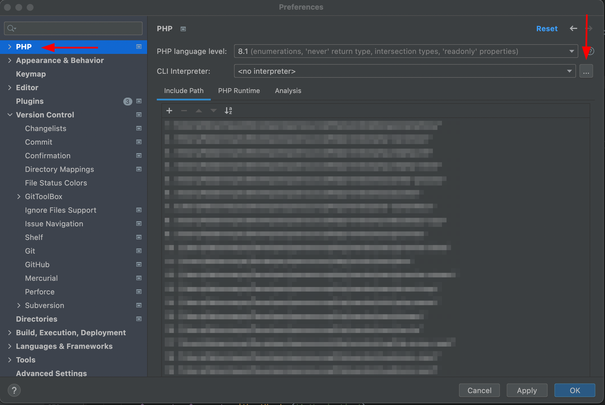
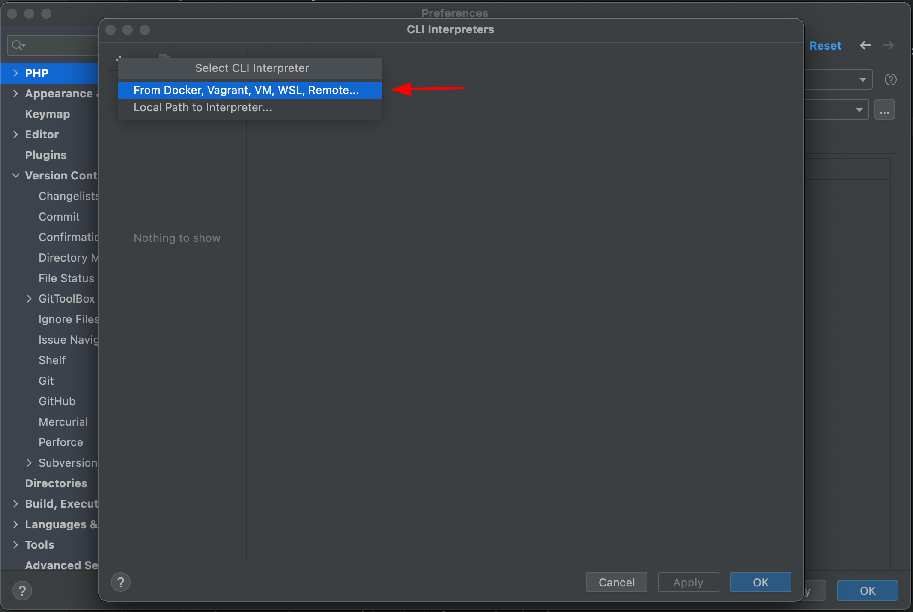
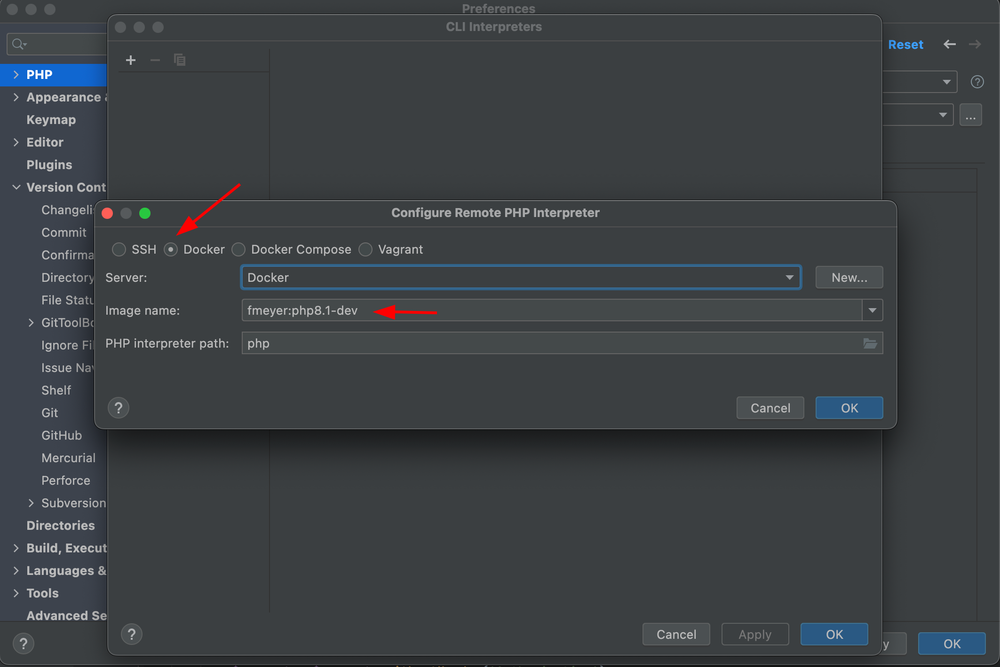
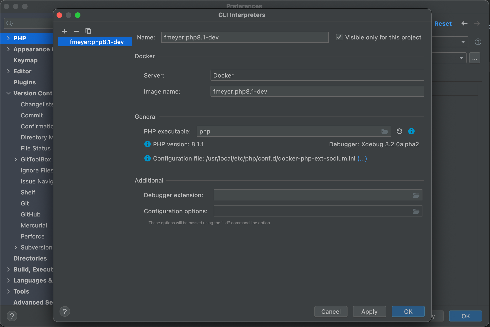
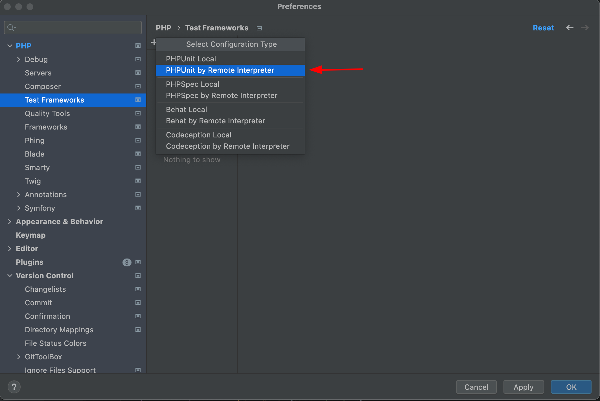
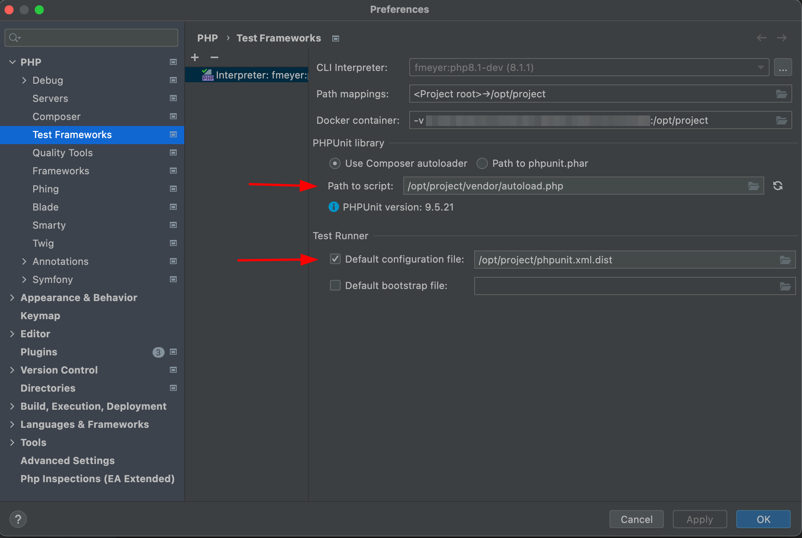

## Was ist Docker und warum sollten wir das benutzen?

Docker ist eine Containerisierungsplattform die es uns ermöglicht unsere Entwicklungsumgebung in speziell auf den Zweck
zugeschnittene Container zu verpacken, die wir dann einfach wiederverwenden können. Ein Docker-Image ist quasi eine 
Anleitung zum Erstellen eines Docker-Containers.

In der Welt von PHP können wir dank Docker ganz einfach mit verschiedenen PHP-Versionen, Composer-Versionen und mehr
arbeiten. Ich werde euch zeigen wie ihr mit Docker eure Entwicklungsprozesse containerisiert und wie ihr
PHP-Skripte lokal (in verschieden PHP-Versionen) ausführen könnt, ohne PHP überhaupt lokal installiert zu haben!

## Gedockertes PHP im Terminal

Normalerweise führen wir PHP Skripte lokal folgendermaßen aus:

```bash{linenos=false,.command}
php script.php
```

Aber wäre es nicht viel cooler wir könnten folgendes machen?

```bash{linenos=false,.command}
php8.1 script.php
php8.0 script.php
php7.4 script.php
```

So könnten wir ganz einfach Skripte in verschiedenen PHP Versionen ausführen, unabhängig von der lokal installierten
Version. Mit einem Docker-Befehl und ein paar Aliassen geht das ganz einfach:

```bash{linenos=false}
alias php8.1="docker run --rm -it -v $PWD:/app -w /app php:8.1-cli php"
```

Mit diesem alias können wir unser Skript in einem Docker-Container ausführen. Aber wie 
funktioniert das Ganze? Lasst und den Docker-Befehl mal genauer anschauen.

```bash{linenos=false}
docker
    run
    --rm
    -it
    -v $PWD:/app
    -w /app
    php:8.1-cli
    php
```

 - `run` = Starten.
 - `--rm` Entfernt den Container, nachdem er das Skript durchlaufen hat.
 - `-it` Erlaubt es uns ein interaktives Terminal zum Container zu öffnen.
 - `-v` Steht für Volume, hiermit wird unser aktuelles Verzeichnis in `/app` im Container gemounted.
 - `-w` Setzt das aktuelle Arbeitsverzeichnis im Container auf `/app` wo unser Skript nun liegt.
 - `php:8.1-cli` Ist das Docker-Image, welches wir nutzen.
 - `php` Den Befehl den wir im Container zu aufrufen.

Jetzt müssen wir uns nur Aliasse für die PHP-Versionen, die wir brauchen in unserer `.bashrc` oder `.zshrc` anlegen.
Wir können übrigens auf die gleiche Art und Weise composer in unseren Projekten nutzen. In eurer `.bashrc`/`.zshrc` 
sollte das dann etwa so aussehen:

```bash{linenos=false}
alias composer="docker run --rm -it -v $PWD:/app -v ${COMPOSER_HOME:-$HOME/.composer}:/tmp composer:latest"
alias composer1="docker run --rm -it -v $PWD:/app -v ${COMPOSER_HOME:-$HOME/.composer}:/tmp composer:1"
alias php8.1="docker run --rm -it -v $PWD:/app -w /app php:8.1-cli php"
alias php8.0="docker run --rm -it -v $PWD:/app -w /app php:8.0-cli php"
alias php7.4="docker run --rm -it -v $PWD:/app -w /app php:7.4-cli php"
```

## Docker-Image für die lokale Entwicklung

Soweit so gut, wir können nun Skripte lokal in verschieden PHP-Versionen ausführen, aber in den meisten Projekten sind
die Anforderungen dann doch etwas komplexer. Was zum Beispiel, wenn wir lokal PHPUnit mit XDebug ausführen möchten um
unsere Code-Coverage herauszufinden oder durch den Code zu debuggen? Anstatt Docker-Images wie `php:8.1-cli` nur zu
benutzen können wir auch eigene Images erstellen, um diese zum Beispiel in PHPStorm für die vorher genannten Zwecke zu 
nutzen. Um ein Image zu erstellen, brauchen wir erstmal ein `Dockerfile`. Darin legen wir dann fest wie unser Image
aufgebaut sein soll. 

```dockerfile
FROM php:8.1.1-cli AS php
FROM composer AS composer
FROM mlocati/php-extension-installer AS php-extension-installer


FROM php AS dev
# copy composer into php image
COPY --from=composer /usr/bin/composer /usr/bin/composer
# copy php-extension-installer into php image
COPY --from=php-extension-installer /usr/bin/install-php-extensions /usr/bin/install-php-extensions
# install xdebug for remote debugging
RUN install-php-extensions xdebug;
```

Fangen wir oben an, zuerst holen wir uns 3 bestehende Images in unser `Dockerfile` und benennen sie. Für unsere Zwecke
brauchen wir natürlich PHP, Composer und zuletzt den PHP Extension Installer. Dann referenzieren wir das PHP Image und
kopieren Composer und PHP Extension Installer in das PHP Image. Dann müssen wir nur noch XDebug installieren und haben
ein fertiges Image. Falls ihr weitere PHP Extensions benötigt könnt ihr deren Namen einfach anhängen: 
`RUN install-php-extensions xdebug apcu redis pdo_mysql gd`. Wie können wir das ganze jetzt in PHPStorm benutzen? Dafür
müssen wir das Image in unser lokales Docker-Repository befördern mit einem Tag, der dem Image einen Namen gibt. Wir
führen folgenden Befehl im Verzeichnis aus wo das `Dockerfile` liegt (oder ersetzen `.` mit dem Pfad). Den Namen könnt
ihr frei auswählen ich benutze `fmeyer/<image-name>`.

```bash{linenos=false,.command}
docker build -t fmeyer:php8.1-dev .
```

## Einrichtung von Docker in PHPStorm

So kommen wir zur Einrichtung in PHPStorm, als Erstes wollen wir ein CLI Interpreter hinzufügen und klicken auf die drei
Punkte.



Hier klicken wir auf das Plus und wählen From Docker, ...



Bei den Punkten wählen wir Docker und suchen in der Liste unser vorher erstelltes Image.



So sollte das dann aussehen wichtig ist dass ihr hier eine PHP und XDebug Version seht.



Das wars für den CLI Interpreter, richten wir nun ein Test Framework ein um PHPUnit in PHPStorm nutzen zu können. Wir
wählen hier nach dem Klick auf Plus PHPUnit by Remote Interpreter.



Wir wählen unseren Interpreter und sollten dann in etwa Folgendes sehen. Wichtig hier auch die PHPUnit Version, außerdem
müsst ihr die richtigen Pfade zu eurer `autoload.php` und eurer PHPUnit Konfiguration wählen.



Auf dieselbe Weise könnt ihr auch die Composer-Integration in PHPStorm einrichten.

## Fazit

So nun können wir endlich unser lokales PHP wegschmeißen (müssen wir aber nicht)! Wir sind jetzt deutlich flexibler in
unserer lokalen Entwicklung und können Docker Experte in unser Resume schreiben 😉. Unten habe ich euch noch ein paar
weiterführende Links zu Dokumentationen da gelassen ✌🏻. Das ist mein erster Blog-Beitrag / Tutorial - ich hoffe, es hat
euch gefallen! Habt ihr Feedback, Vorschläge, Verbesserungen oder ein Rechtschreibfehler gefunden 😱? Lasst es mich
wissen oder öffnet hier eine PR --> [GitHub](https://github.com/dinooo13/fmeyer.dev-content)