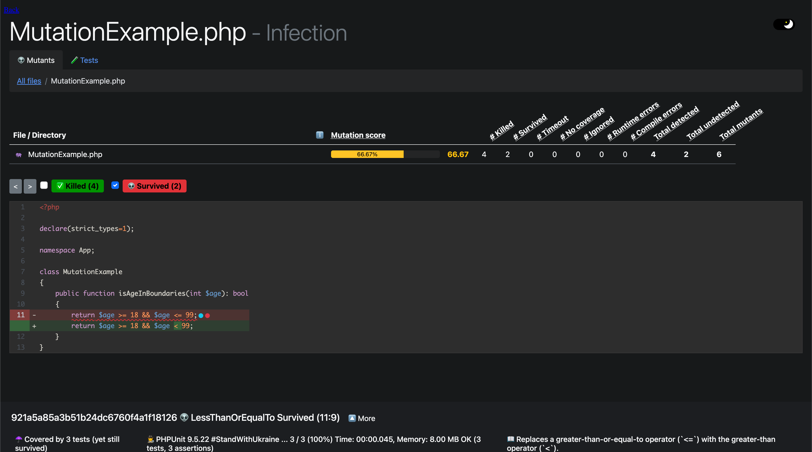

## When code coverage is just not enough...

Test quality is often a big question mark in software development. High or low coverage in the end everything depends on
the effectiveness of the testsuite. Mutation testing is a technique, we can use to get a deeper insight into the quality
of our tests. But how can mutation testing help us? Like the name suggests it's mutating our code, if a test is green
even though the code was modified the mutant is escaped. On the other hand if the test turns out to be red, the mutant
was caught. Lets look at some code examples to understand how our code is mutated.

## Mutations

### Visibility

The visibility mutation changes, as the name suggests the visiblity of a method to ensure it's as strict as possible. 
For example if a `public` method gets changed to `private` and our tests are still green, there was no reason to expose this
method in the first place.

### Edge cases in ranges

Often we have to catch edge cases in our code. Especially when checking if a variable is in a given range. For example
age verification from 18 to 99, the code for this could look something like this:

```php
    public function isAgeInBoundaries(int $age): bool
    {
        return $age >= 18 && $age <= 99;
    }
```

This mutation replaces `<=` with `<` and `>=` with `>` and the other way around. This ensures our test suite contains 
tests for the edge cases of our range.

### Logic

The logic mutation is putting our logic in expressions to the test. Lets look at a code exmaple.

```php
    public function isAgeInBoundaries(int $age): bool
    {
        return $age >= 18 || $age <= 99;
    }
```

I replaced the `&&` with a `||`, now every age equal or above 18 OR equal or lower than 99 is valid. If our test is not 
catching this change to our code, we're gonna have problem because every age is now allowed in our application. If we
negate the expression with a `!` we get this `!($age >= 18 && $age <= 99)` we have a different problem now every age out
of our range is accepted. What we did to our code example is basically what the logic mutation does automatically for us.

### More mutations

These small changes may seem like they will be noticed right away, but many of these errors can happen while refactoring
and can go unnoticed for a long time in a bigger codebase. If you run mutation tests against your code many more 
mutations will be used. infectionPHP allows us to integrate mutation testing in a php project and analyze the test 
quality.

## How to get started

We can add infectionPHP to our project by simply requiring it with composer. 

```bash {linenos=false,.command}
composer require infection/infection:^0.26
```

Next we create a configuration file for infectionPHP. In the configuration we can control which directories or files
should be analyzed and which mutations to use. Additionally, we can specify where our PHPUnit executable and 
configuration is located to include their settings. The last thing to configure is output files, like a html report.

configuration file `infection.json`

```json
{
    "$schema": "vendor/infection/infection/resources/schema.json",
    "source": {
        "directories": [
            "src"
        ]
    },
    "mutators": {
        "@arithmetic": true,
        "@boolean": true,
        "@cast": true,
        "@conditional_boundary": true,
        "@conditional_negotiation": true,
        "@default": true,
        "@equal": true,
        "@function_signature": true,
        "@identical": true,
        "@number": true,
        "@operator": true,
        "@regex": true,
        "@removal": true,
        "@return_value": true,
        "@sort": true,
        "@unwrap": true,
        "@extensions": true
    },
    "logs": {
        "html": "infection.html"
    },
    "phpUnit": {
        "configDir": ".",
        "customPath": "vendor\/bin\/phpunit"
    }
}
```

Of course, we don't want to remember how to run infectionPHP, so it's good practice to add a composer script to run the 
mutation tests. infectionPHP automatically runs PHPUnit with coverage, so a coverage engine like XDebug is required. We
can use our php docker image for development from my last tutorial for this.

```json
    "scripts": {
        "mutation" : ["infection"]
    },
```

Now run infectionPHP with the following command:

```bash {linenos=false,.command}
composer mutation
```

## Metrics in mutation testing

infectionPHP generates a html report with our configuration as well as some metrics printed out in the console.
What is the meaning of these metrics?

### Mutation Score Indicator (MSI)

The Mutation Score Indicator or MSI for short, is the percentage of catched mutants in the whole codebase. The MSI
is the primary quality metric of our testsuite. Given an MSI of 60% and a code coverage of 80%, there is a 20%
difference so our test quality is not really good in this example. The MSI is calculated like this:

`MSI = (Catched mutants / All mutants) * 100`

### Mutation Code Coverage (MCC)

The MCC shows how much percent of the mutants a covered by out testsuite.
The MCC is calculated like this.

`Covered mutants = All mutants - Uncovered mutants`

`MCC = (Covered mutants / All mutants) * 100`

### Covered Code MSI


Covered Code MSI is the same as the MSI but restricted to mutants covered by our testsuite. This makes it easy to
determine how effective our current testsuite really is. It's calculated like this:

`Covered mutants = All mutants - Uncovered mutants`

`CoveredCodeMSI = (Catched mutants / Covered mutants) * 100`


## Results

The html report visualizes the results of the mutation tests, we can also see which mutants escaped our testsuite. This
makes it really easy to catch these mutants in a new test. I prepared a little
[example repo](https://github.com/dinooo13/mutation-testing-example) on GitHub. In this repo we find a small project
with a testsuite and some uncovered mutants. Let's clone the repo and run infectionPHP, it generates the html report, if
we open it up we see the following:




To catch these mutants, we will write a new test, but first let's take a look at the current test suite.

```php
class MutationExampleTest extends TestCase
{
    /**
     * @test
     * @dataProvider mutationExampleDataProvider()
     */
    public function AgeShouldReturnBool(int $age, bool $result): void
    {
        $subject = new MutationExample();

        self::assertSame($result, $subject->isAgeInBoundaries($age));
    }

    private function mutationExampleDataProvider(): Generator
    {
        yield [18, true];
        yield [25, true];
        yield [55, true];
    }
}
```

We have one test with an attached dataprovider, our code coverage is 100%, but with a little experience you will quickly
spot the loopholes in our testsuite. We need some tests that make more sense and test all edge cases in our range. So
let's add them.

```php
    private function mutationExampleDataProvider(): Generator
    {
        yield [17, false];
        yield [18, true];
        yield [random_int(19, 98), true];
        yield [99, true];
        yield [100, false];
    }
```

If we run infectionPHP again, we see we have 100% MSI.

## Conclusion

So this is the end of my second article, I hope you liked it, and you can use some of this knowledge in your next 
project. I left you some useful links again at the end of the article if you want to dive deeper ✌🏻. Got feedback, 
suggestions, improvements or found a typo 😱? Let me know or file a PR here --> 
[GitHub](https://github.com/dinooo13/fmeyer.dev-content).