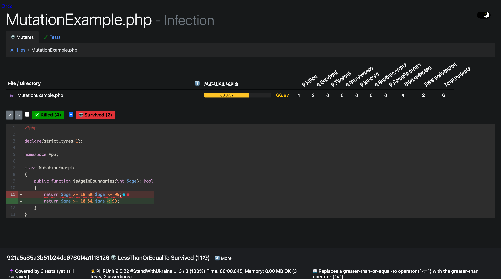
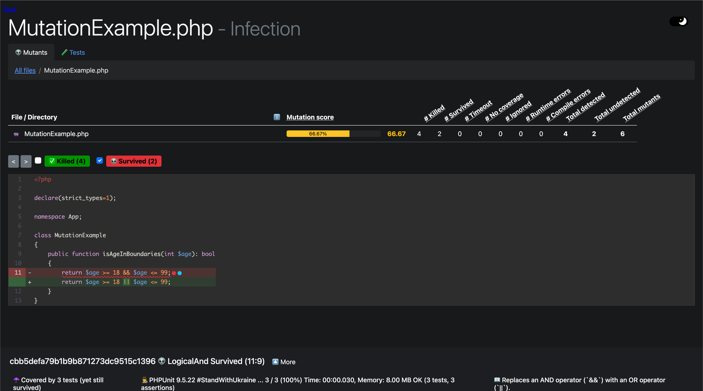

## Wenn Code Coverage einfach nicht genug ist...

Oft ist die Testqualität ein großes Fragezeichen in der Entwicklung, ob nun hohe oder niedrige Coverage im Endeffekt
kommt es darauf an wie aussagekräftig die Testsuite ist. Mutation Testing ist eine Vorgehensweise mit der wir einen 
tieferen Einblick in die Qualität unserer Tests bekommen. Aber wie schafft Mutation Testing das? Wie der Name schon 
vermuten lässt mit Mutationen am Code. Wenn ein Test trotz Mutation am Code grün ist, heißt das der Mutant ist entkommen,
schlägt der Test hingegen fehl, wurde der Mutant gefangen. Schauen wir uns doch beispielhaft ein paar der Mutationen an die 
vorgenommen werden.

## Mutationen

### Sichtbarkeit

Bei der Sichtbarkeitsmutation wird die Sichtbarkeit einer Methode verändert, um herauszufinden, ob diese so eingeschränkt
wie möglich ist. Wird zum Beispiel eine Methode von `public` zu `private` geändert und unser Test ist weiterhin grün,
können wir davon ausgehen das diese Methode ohne triftigen Grund offengelegt wird.

### Grenzen von Mengen

Oft müssen wir in unserem Code prüfen, ob bestimmte Variablen sich in einer bestimmten abgegrenzten Menge befinden. Zum
Beispiel bei einer Altersbegrenzung von 18 bis 99. Dabei würde in wohl etwa Folgendes draus entstehen:

```php
    public function isAgeInBoundaries(int $age): bool
    {
        return $age >= 18 && $age <= 99;
    }
```

Diese Mutation tauscht `<=` mit `<` und `>=` mit `>` und andersherum. So wird sichergestellt, dass unsere Testsuite prüft,
ob wir die Grenzen unserer erlaubten Menge abtesten.

### Logik

Mit der Logikmutation wird die Logik in unseren Ausdrücken geprüft. Schauen wir uns das Ganze an unserem 
Code-Beispiel an.

```php
    public function isAgeInBoundaries(int $age): bool
    {
        return $age >= 18 || $age <= 99;
    }
```

Ich habe das `&&` mit einem `||` getauscht, nun wäre jedes Alter erlaubt, welches größer-gleich 18
ODER kleiner-gleich 99 ist. Wenn unser Test diese Veränderung im Code nicht bemerkt, haben wir ein Problem, denn jetzt ist
jedes Alter in unserem Programm erlaubt. Würden wir den Ausdruck mit einem vorangestellten `!` negieren
`!($age >= 18 && $age <= 99)` hätten wir auch ein Problem, denn jetzt sind nur Werte außerhalb unserer Grenzen erlaubt.
Damit haben wir manuell ausgeführt, was die Logikmutation automatisiert ausführt.

### Weitere Mutationen

Zunächst mögen diese kleinen Anpassungen so wirken, als würden sie einem auch so sofort auffallen, aber viele dieser
Fehler können bei Refactorings passieren und in einer größeren Codebase auch länger nicht entdeckt werden. Im Mutation 
Testing werden noch viele weitere dieser Mutationen durchlaufen. Mithilfe von infectionPHP können wir Mutation Testing
in ein PHP Projekt einbauen und dessen Testqualität auf die Probe stellen. 

## Einrichtung und Konfiguration

Wir können infectionPHP in unserem Projekt einfach via composer installieren.

```bash {linenos=false,.command}
composer require infection/infection:^0.26
```

Als Nächstes legen wir eine Konfigurationsdatei für infectionPHP an. In der Konfigurationsdatei können wir festlegen,
welche Ordner/Dateien infectionPHP durchlaufen soll und welche Mutationen es benutzen soll. Außerdem können wir angeben,
wo unsere PHPUnit Installation und Konfiguration liegt um diese miteinzubeziehen. Zusätzlich können wir Ausgabedateien,
wie einen HTML-Report generieren lassen.

Konfigurationsdatei `infection.json`

```json
{
    "$schema": "vendor/infection/infection/resources/schema.json",
    "source": {
        "directories": [
            "src"
        ]
    },
    "mutators": {
        "@arithmetic": true,
        "@boolean": true,
        "@cast": true,
        "@conditional_boundary": true,
        "@conditional_negotiation": true,
        "@default": true,
        "@equal": true,
        "@function_signature": true,
        "@identical": true,
        "@number": true,
        "@operator": true,
        "@regex": true,
        "@removal": true,
        "@return_value": true,
        "@sort": true,
        "@unwrap": true,
        "@extensions": true
    },
    "logs": {
        "html": "infection.html"
    },
    "phpUnit": {
        "configDir": ".",
        "customPath": "vendor\/bin\/phpunit"
    }
}
```

Um uns den Befehl für die Ausführung nicht merken zu müssen legen wir einfach ein composer script an, damit können wir die 
Tests dann einfach ausführen. infectionPHP lässt PHPUnit mit Coverage selbst durchlaufen und benötigt dann natürlich 
eine Coverage Engine wie XDebug. Hier können wir zum Beispiel unser PHP-Docker Image für die Entwicklung aus meinem 
letzten Tutorial nutzen.

```json
    "scripts": {
        "mutation" : ["infection"]
    },
```

Mit folgendem Befehl können wir nun infectionPHP ausführen:

```bash {linenos=false,.command}
composer mutation
```

## Kennzahlen im Mutation Testing

infectionPHP liefert uns mit unserer Konfiguration einen HTML-Report und mehrere Kennzahlen in der Konsole. 
Was bedeuten diese Kennzahlen?

### Mutation Score Indicator (MSI)

Der Mutation Score Indicator kurz MSI, gibt an wie viel Prozent der generierten Mutanten entdeckt wurde. Der MSI ist der
primäre Indikator für die Qualität unserer Testsuite. Angenommen wir haben einen MSI von 60 % bei einer Code Coverage von
80 %, da ergibt sich eine Differenz von 20 %. Dies bedeutet für uns, dass die Qualität unserer Testsuite nicht
besonders gut ist. Berechnet wird die MSI folgendermaßen:

`MSI = (Entdeckte Mutanten / Alle Mutanten) * 100`

### Mutation Code Coverage (MCC)

Die MCC gibt an wie viel Prozent der Mutanten von unserer Testsuite abgedeckt werden.
Berechnet wird die MCC folgendermaßen:

`Abgedeckte Mutanten = Alle Mutanten - Nicht abgedeckte Mutanten`

`MCC = (Abgedeckte Mutanten / Alle Mutanten) * 100`

### Covered Code MSI

Covered Code MSI ist einfach der MSI, in dem Teil des Codes der von unserer Testsuite abgedeckt wird. Daran können wir
erkennen wie effektiv unsere vorhandenen Tests sind. Berechnet wird es folgendermaßen:

`Abgedeckte Mutanten = Alle Mutanten - Nicht abgedeckte Mutanten`

`CoveredCodeMSI = (Entdeckte Mutanten / Abgedeckte Mutanten) * 100`


## Ergebnisse

Im HTML-Report können wir uns das Ergebnis visuell aufbereitet anzeigen lassen, dabei sehen wir auch welche Mutationen 
nicht gefangen wurden. Das gibt uns einen guten Tipp wie wir diesen Mutanten in einem neuen Test abfangen können. Ich
habe ein kleines [Beispielrepo](https://github.com/dinooo13/mutation-testing-example) auf GitHub vorbereitet, wo wir 
zusammen einen nicht abgedeckten Mutanten mit einem neuen Test fangen. Klonen wir das Repo und führen infectionPHP aus 
wird uns ein HTML-Report generiert, schauen wir in den Report sehen wir Folgendes:





Um diesen Mutanten nun abzufangen, schreiben wir einen neuen Test. Schauen wir uns zunächst die aktuelle Testsuite an:

```php
class MutationExampleTest extends TestCase
{
    /**
     * @test
     * @dataProvider mutationExampleDataProvider()
     */
    public function AgeShouldReturnBool(int $age, bool $result): void
    {
        $subject = new MutationExample();

        self::assertSame($result, $subject->isAgeInBoundaries($age));
    }

    private function mutationExampleDataProvider(): Generator
    {
        yield [18, true];
        yield [25, true];
        yield [55, true];
    }
}
```

Wir haben einen Test mit angehängtem DataProvider, unsere Code Coverage ist 100 %, aber das geschulte Auge erkennt
schnell, dass diese Tests nicht ausreichend sind. Mit sinnvolleren Tests die, die Grenzen unserer Logik ausschöpfen
erreichen wir ein besseres Ergebnis. Fügen wir diese also hinzu.

```php
    private function mutationExampleDataProvider(): Generator
    {
        yield [17, false];
        yield [18, true];
        yield [random_int(19, 98), true];
        yield [99, true];
        yield [100, false];
    }
```

Lassen wir infectionPHP nun noch einmal laufen sehen wir, wir haben 100 % MSI. 

## Fazit

Damit kommen wir auch zum Ende dieses Artikels ich hoffe, es hat euch gefallen und ihr konntet etwas für eure 
Softwareprojekte mitnehmen! Unten habe ich euch wieder ein paar weiterführende Links zu Dokumentationen da gelassen ✌🏻.
Habt ihr Feedback, Vorschläge, Verbesserungen oder ein Rechtschreibfehler gefunden 😱? Lasst es mich wissen oder öffnet 
hier eine PR –> [GitHub](https://github.com/dinooo13/fmeyer.dev-content).